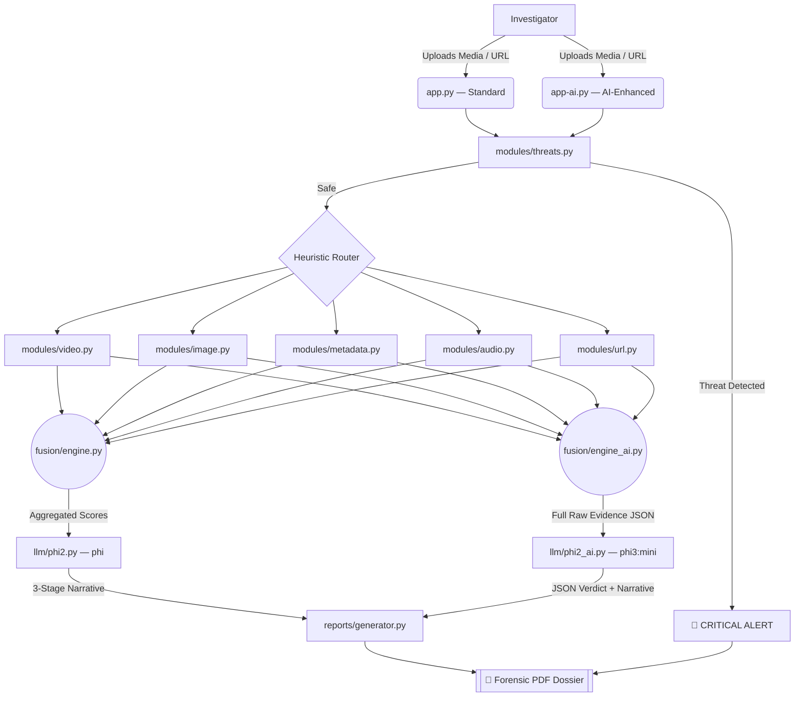

# TrueSight: System Architecture

## 🏗️ Dual-App Architecture Overview

TrueSight ships in two modes that share the same heuristic engines but differ in how they use the LLM:

| Component | Standard (`app.py`) | AI-Enhanced (`app-ai.py`) |
|---|---|---|
| Heuristic Engines | ✅ Same | ✅ Same |
| Fusion | `engine.py` — simple average | `engine_ai.py` — LLM reasoning |
| LLM Model | `phi` (Phi-2) | `phi3:mini` |
| LLM Role | Report narration only | Evidence reasoning + narration |
| LLM Input | Formatted score text | Full raw evidence JSON |
| LLM Output | 3-stage narrative | Structured JSON verdict + narrative |

---

## 📐 Standard Mode Flow (`app.py`)

```text
[User Upload / URL Input]
         │
         ▼
[Binary Malware Scanner]  ──(Threat Found)──► [CRITICAL ALERT]
         │
   (File Verified Safe)
         │
         ▼
[Heuristic Data Router]
    ├─► video.py   ─┐
    ├─► image.py   ─┤
    ├─► metadata.py─┤──► [fusion/engine.py] (simple score average)
    ├─► audio.py   ─┤              │
    └─► url.py     ─┘              ▼
                         [llm/phi2.py — phi model]
                         (narrates 3-stage report from scores)
                                   │
                                   ▼
                         [reports/generator.py → PDF]
```

---

## 🧠 AI-Enhanced Mode Flow (`app-ai.py`)

```text
[User Upload / URL Input]
         │
         ▼
[Binary Malware Scanner]  ──(Threat Found)──► [CRITICAL ALERT]
         │
   (File Verified Safe)
         │
         ▼
[Heuristic Data Router]
    ├─► video.py   ─┐  (full result dict — not just score)
    ├─► image.py   ─┤
    ├─► metadata.py─┤──► [fusion/engine_ai.py]
    ├─► audio.py   ─┤         │
    └─► url.py     ─┘         ▼
                     [llm/phi2_ai.py — phi3:mini]
                     llm_reason_verdict(all_evidence)
                              │
                              ▼
                     Structured JSON Verdict:
                     { threat_score, ai_generated_score,
                       manipulation_score, final_score,
                       confidence, key_findings, verdict }
                              │
                              ▼
                     [phi3:mini narrates 3-stage report]
                              │
                              ▼
                     [reports/generator.py → PDF]
                     (includes per-category score table)
```

---

## 🗂️ Project File Map

```
TrueSight/
│
├── app.py                  ← Standard mode entry point
├── app-ai.py               ← AI-Enhanced mode entry point
│
├── modules/
│   ├── threats.py          ← Binary/magic-byte malware scanning
│   ├── image.py            ← ELA + blur detection
│   ├── metadata.py         ← EXIF extraction & heuristics
│   ├── audio.py            ← MFCC, spectral flatness, SNR
│   ├── video.py            ← Frame diff, optical flow, audio extraction
│   └── url.py              ← Lexical phishing heuristics
│
├── fusion/
│   ├── engine.py           ← Standard: weighted score average
│   └── engine_ai.py        ← AI-Enhanced: LLM JSON verdict engine
│
├── llm/
│   ├── phi2.py             ← Standard: generate_ai_explanation(text)
│   └── phi2_ai.py          ← AI-Enhanced: llm_reason_verdict() + generate_ai_explanation(verdict, evidence)
│
├── reports/
│   └── generator.py        ← ReportLab PDF builder (shared by both modes)
│
├── README.md               ← Quick start & overview
├── setup.md                ← Full installation guide (all platforms)
├── arc.md                  ← This file — architecture deep-dive
└── requirements.txt        ← Python dependencies
```

---

## 🔄 Mermaid Flowchart — Full Dual-App Pipeline



---

## ⚡ Key Design Decisions

- **Offline-first**: All models run via Ollama locally. No cloud API calls. Safe for malicious payload analysis.
- **Graceful degradation**: `engine_ai.py` falls back to simple averaging if Ollama is unavailable.
- **Shared reporting layer**: Both modes write to the same `reports/generator.py`. The AI-Enhanced PDF additionally includes a per-category score table.
- **`temperature: 0.0`** for the verdict JSON call → deterministic, reproducible outputs.
- **`temperature: 0.1`** for the narrative call → slightly creative but still factual.
