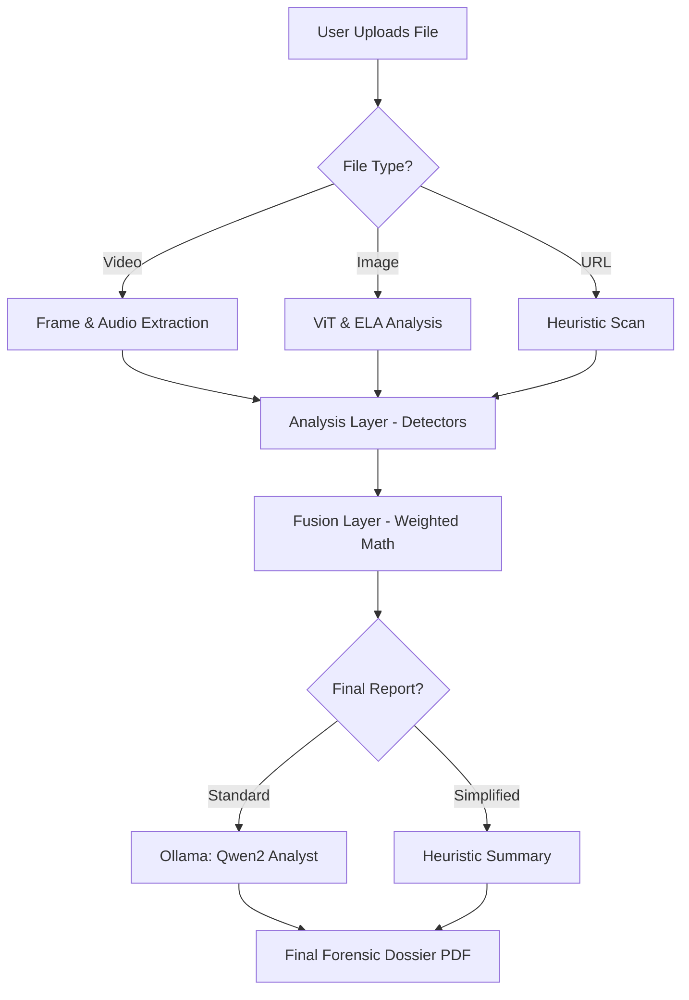

# Design Document: TrueSight AI

**Objective**: A lightweight, multimodal cyber forensic tool optimized for 8GB RAM systems. It uses specialized AI detectors and local LLMs to analyze media for AI-generation and manipulation.

---

## 1. System Architecture

The tool follows a **Three-Layer Logic Flow**:

### A. Analysis Layer (The Detectors)
Used to extract raw evidence from files. These are **non-LLM** models for maximum speed.
- **Vision (Image/Video)**: Uses `google/vit-base-patch16-224-in21k` tuned for AI-image detection.
- **Signal (Audio)**: Uses `librosa` for pitch std, RMS energy consistency, and MFCC delta analysis.
- **Metadata**: Uses `ffmpeg` and `PIL` (EXIF) to find software traces.
- **URL**: Uses custom entropy (DGA) and homograph detection logic.

### B. Fusion Layer (The Logic)
A mathematical engine (`fusion/engine.py`) that combines scores from all detectors:
- **Weighted logic**: Image (35%), Audio (25%), Video (25%), URL (15%).
- **Threat Overrides**: If the Malware Scanner (`threats.py`) finds a high risk, the final score is automatically set to 100%.

### C. Narrative Layer (The Analyst)
An LLM (`qwen2:0.5b`) that interprets the numeric fusion results and generates a human-readable dossier.
- **Module**: `llm/llm.py` (Renamed from `phi3.py`).
- **No RAG**: All evidence is passed directly in the prompt (no vector database needed).
- **Fallback**: If Ollama is unavailable, the system reverts to a heuristic "Simplified Report."

---

## 2. Technology Stack

- **UI**: Streamlit (Python)
- **Local AI Brain**: Ollama (`qwen2:0.5b`)
- **Computer Vision**: Transformers + PyTorch (CPU-only Optimized)
- **Audio Processing**: Librosa + FFmpeg
- **Phish Detection**: TLDextract + Custom Regex

---

## 3. 8GB RAM Optimization Layers

To prevent performance hangs on local hardware, three specialized modes are implemented:

- **Low Resource Mode**: Skips temporal video consistency (SSIM) and reduces frame sampling to `N=1`.
- **Lite AI Mode**: Defaults the "Analyst" role to **Qwen2 (0.5B)**, reducing the LLM RAM footprint from 2.2GB to ~0.4GB.
- **Simplify Report (Bypass)**: Allows users to disable the LLM entirely for instant results.

---

## 4. Logical Flow Diagram (Mermaid)

