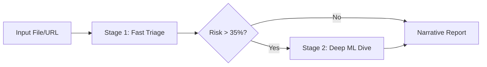

# ⚡ TrueSight: High-Accuracy, Low-Latency Workflow

To achieve the deep accuracy of the **AI-Enhanced Mode** with the near-instant response of the **Ultra-Lite Mode**, we recommend the following "Hybrid Triage" workflow.

---

## 🏛️ 1. Architecture: The Triage-First Method

Instead of running heavy Machine Learning (ML) models on every file, use a multi-stage approach where we only "wake up" the expensive models if the fast heuristics detect an anomaly.

### 🔄 The Three-Stage Pipeline



1.  **Stage 1: Fast Triage (5-8 seconds)**
    *   **Binary Scan**: Check magic bytes and polyglot shells (`threats.py`).
    *   **EXIF Inspection**: Check for missing or suspicious camera metadata (`metadata.py`).
    *   **Heuristic Signal**: Error Level Analysis (ELA) and Audio Pitch std dev.
2.  **Stage 2: Deep ML Dive (Trigger Dependent: 15-30 seconds)**
    *   **ViT (Vision Transformer)**: Run only if ELA Map is highly "noisy."
    *   **SSIM Temporal**: Run only if video frame transitions are suspect.
    *   **Full ML Reasoning**: Triggered only if Stage 1 highlights specific red flags.

---

## 🛠️ 2. Implementation Strategies

### A. Parallel Analysis (Python)
Currently, analysis is sequential. Using `ThreadPoolExecutor` can cut processing time by **40-60%**.

```python
# Proposed logic for app-ai.py
with concurrent.futures.ThreadPoolExecutor() as executor:
    # Kick off metadata and binary scans in the background
    future_meta = executor.submit(check_metadata, file_path)
    future_threat = executor.submit(scan_for_threats, file_path)
    
    # Run the primary heuristic in main thread
    img_res = analyze_image_ai(file_path)
    
    # Collect results
    meta_res = future_meta.result()
    threat_res = future_threat.result()
```

### B. Intelligent Caching
Since forensic files are often analyzed multiple times, we implementation a content-hash cache.
```python
# hash(file_content) -> results_dict cached for 24 hours
```

### C. LLM Streaming
Instead of waiting for the full PDF generation, the LLM investigation report should **stream** to the user in the UI as it's being "thought" out.

---

## 📅 3. Recommended Operator Workflow

1.  **Bulk Triage**: Run everything through `app-mini.py` first to identify "Hot" files.
2.  **Escalation**: For files with > 60% risk from `app-mini`, re-analyze specifically in `app-ai.py`.
3.  **Human Verification**: Use the **ELA maps** and **SSIM graphs** to manually verify the LLM's reasoning before finalizing any forensic dossier.
